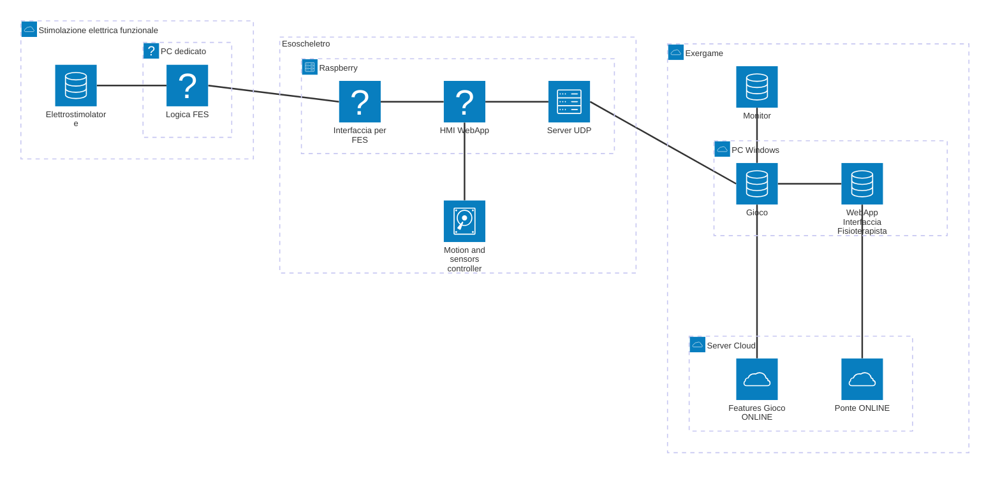

# Schema

```mermaid
architecture-beta
    group exo[Esoscheletro]
    group rasp(server)[Raspberry] in exo
    service exo_hmi(application)[HMI WebApp] in rasp
    service arduino(disk)[Motion and sensors controller] in exo
    service server(server)[Server UDP] in rasp
    service fes_interface(z)[Interfaccia per FES] in rasp

    exo_hmi:R -- L:server
    arduino:T -- B:exo_hmi
    fes_interface:R -- L:exo_hmi

    group exergame(cloud)[Exergame]
    group pc_game(cloud)[PC Windows] in exergame
    service display(database)[Monitor] in exergame
    service game(database)[Gioco] in pc_game
    service game_interfaccia(database)[WebApp Interfaccia Fisioterapista] in pc_game

    display:B -- T:game
    game:L -- R:server
    game:R-- L:game_interfaccia

    group server_online(cloud)[Server Cloud] in exergame
    service game_online(cloud)[Features Gioco ONLINE] in server_online
    service interfaccia_online(cloud)[Ponte ONLINE] in server_online

    game:B -- T:game_online
    game_interfaccia:B -- T:interfaccia_online

    group fes(cloud)[Stimolazione elettrica funzionale]
    group pc_fes(z)[PC dedicato] in fes
    service elettrostimolatore(database)[Elettrostimolatore] in fes
    service logica_fes(z)[Logica FES] in pc_fes

    elettrostimolatore:R-- L:logica_fes
    logica_fes:R-- L:fes_interface
```
