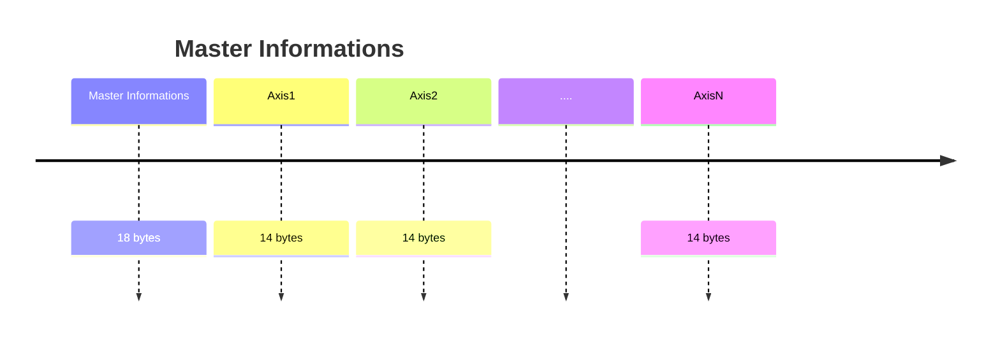

# Message information structure

Nel caso attuale di un sistema a 4 assi il numero di byte trasmessi è 74. La struttura è la seguente.

### Master Informations 

<table><thead><tr><th width="79.90911865234375">Byte</th><th width="186">Nome</th><th width="114.45458984375">Tipo Dato</th><th width="99.727294921875">N bytes</th><th>Descrizione</th></tr></thead><tbody><tr><td>0</td><td>Status booleans byte</td><td><code>bool</code></td><td>1</td><td>Stato attuale in formato boolean</td></tr><tr><td>1</td><td>Status + Working Mode</td><td><code>uint8</code></td><td>1</td><td>Stato + modalità operativa</td></tr><tr><td>2-5</td><td>X</td><td><code>float32</code></td><td>4</td><td>Posizione X cartesiana della mano in mm</td></tr><tr><td>6-9</td><td>Y</td><td><code>float32</code></td><td>4</td><td>Posizione Y cartesiana della mano in mm</td></tr><tr><td>10-13</td><td>Z</td><td><code>float32</code></td><td>4</td><td>Posizione Z cartesiana della mano in mm</td></tr><tr><td>14–17</td><td>GOMITO</td><td><code>float32</code></td><td>4</td><td>Posizione dell'asse 3 in gradi.</td></tr></tbody></table>

**Status booleans byte - Master Informations**

<table><thead><tr><th width="79.727294921875">Bit</th><th width="190.181884765625">Nome</th><th width="114.4544677734375">Tipo Dato</th><th>Descrizione</th></tr></thead><tbody><tr><td>7</td><td>Parity</td><td><code>bit</code></td><td>Bit di parità per validare il byte (gli 1 sono sempre pari)</td></tr><tr><td>6</td><td>Debug</td><td><code>bit</code></td><td>Not used</td></tr><tr><td>4-5</td><td>Spare</td><td><code>bit</code></td><td>Not used</td></tr><tr><td>3</td><td>Error</td><td><code>bit</code></td><td>0 ->no error</td></tr><tr><td>2</td><td>Warning</td><td><code>bit</code></td><td>0 ->no warning</td></tr><tr><td>1</td><td>Motion ongoing</td><td><code>bit</code></td><td>​</td></tr><tr><td>0</td><td>On target position</td><td><code>bit</code></td><td>​</td></tr></tbody></table>

**Status + WorkingMode - Master Informations**

<table><thead><tr><th width="81.54547119140625">Bit</th><th width="192.9090576171875">Nome</th><th width="113.272705078125">Tipo Dato</th><th>Descrizione</th></tr></thead><tbody><tr><td>4-7</td><td>Status</td><td><code>uint4</code></td><td>Stato della FSM del master</td></tr><tr><td>0-3</td><td>Working mode</td><td><code>uint4</code></td><td>Working mode attuale</td></tr></tbody></table>

### Axis Informations 

<table><thead><tr><th width="81.727294921875">Byte</th><th width="194.18182373046875">Nome</th><th width="116.0909423828125">Tipo Dato</th><th width="98.8182373046875">N bytes</th><th>Descrizione</th></tr></thead><tbody><tr><td>0</td><td>Status booleans byte</td><td><code>bool</code></td><td>1</td><td>Stato attuale in formato boolean</td></tr><tr><td>1</td><td>Status + Mode</td><td><code>uint8</code></td><td>1</td><td>Stato + modalità operativa</td></tr><tr><td>2–5</td><td>Actual Position</td><td><code>float32</code></td><td>4</td><td>Posizione attuale dell'asse in gradi</td></tr><tr><td>6–9</td><td>Actual Torque</td><td><code>float32</code></td><td>4</td><td>Coppia attuale dell'asse in risoluzione del sensore</td></tr><tr><td>10–13</td><td>Actual Frequency</td><td><code>float32</code></td><td>4</td><td>Velocità dell'asse in gradi/sec</td></tr></tbody></table>

\
