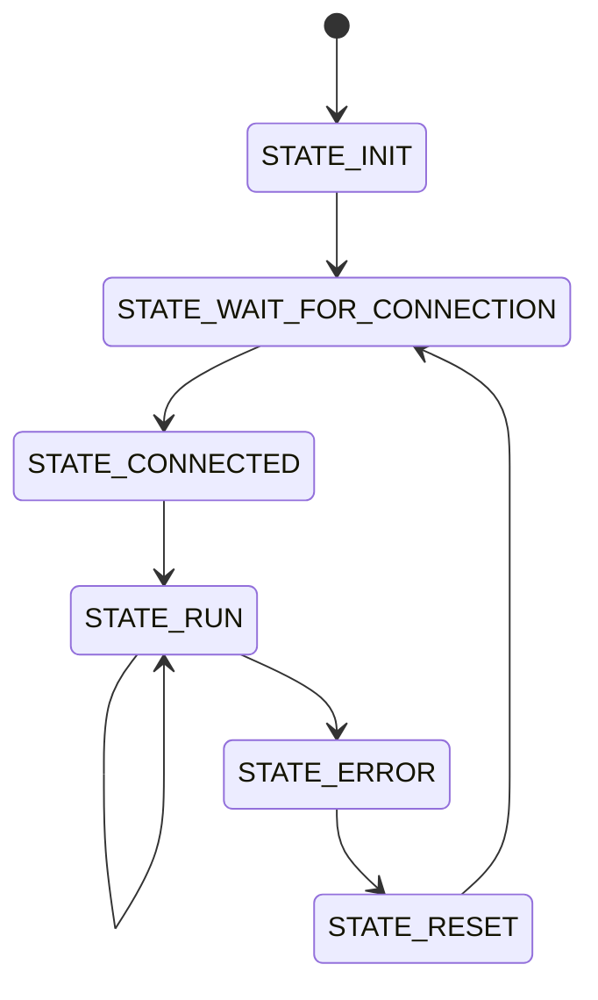

# Main FSM

```mermaid
stateDiagram-v2
    [*] --> STATE_INIT
    STATE_INIT--> STATE_WAIT_FOR_CONNECTION
    STATE_WAIT_FOR_CONNECTION--> STATE_CONNECTED
    STATE_CONNECTED--> STATE_RUN
    STATE_RUN--> STATE_RUN
    STATE_RUN--> STATE_ERROR
    STATE_ERROR--> STATE_RESET
    STATE_RESET--> STATE_WAIT_FOR_CONNECTION
```
