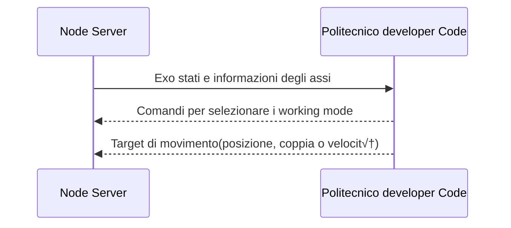

# Schema di comunicazione

```mermaid
sequenceDiagram
    Node Server ->> Politecnico developer Code: Exo stati e informazioni degli assi
    Politecnico developer Code-->>Node Server: Comandi per selezionare i working mode
    Politecnico developer Code-->>Node Server: Target di movimento(posizione, coppia o velocità)
```
