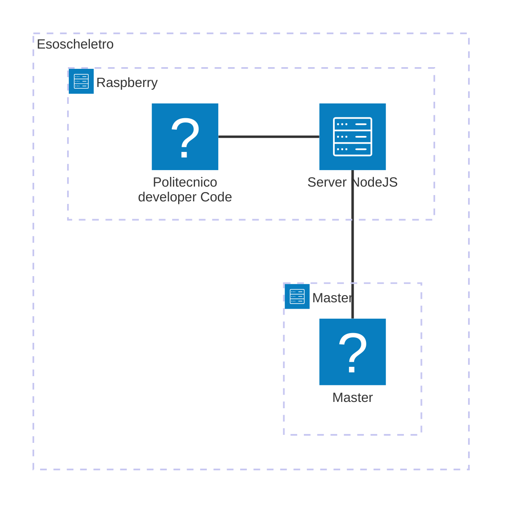

# Software blocks

```mermaid
architecture-beta
    group exo[Esoscheletro]
    group master(server)[Master] in exo
    service master_pc(z)[Master] in master
    group rasp(server)[Raspberry] in exo
    service back(server)[Server NodeJS] in rasp
    service code(application)[Politecnico developer Code] in rasp
   
    code:R -- L:back
    master_pc:T -- B:back
  
```
