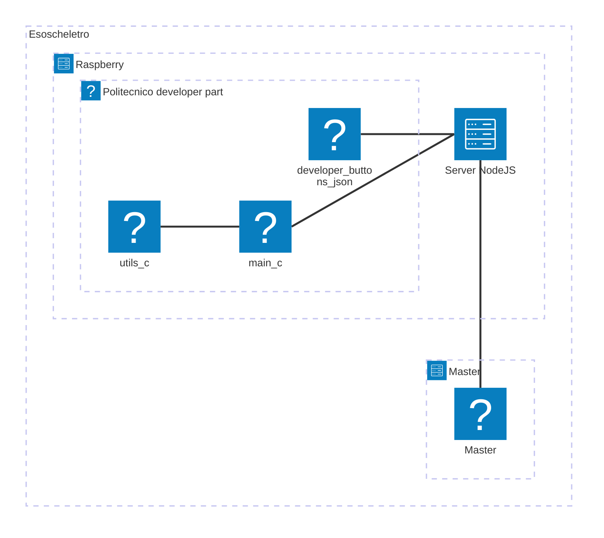

# Software blocks

```mermaid
architecture-beta
    group exo[Esoscheletro]
    group master(server)[Master] in exo
    service master_pc(z)[Master] in master
    group rasp(server)[Raspberry] in exo
    service back(server)[Server NodeJS] in rasp
    group poli(application)[Politecnico developer part] in rasp
    service main_code(application)[main_c] in poli
    service utils_code(application)[utils_c] in poli
    service button_settings(application)[developer_buttons_json] in poli
   
    main_code:R -- L:back
    main_code:L -- R:utils_code
    button_settings:R -- L:back
    master_pc:T -- B:back
  
```
